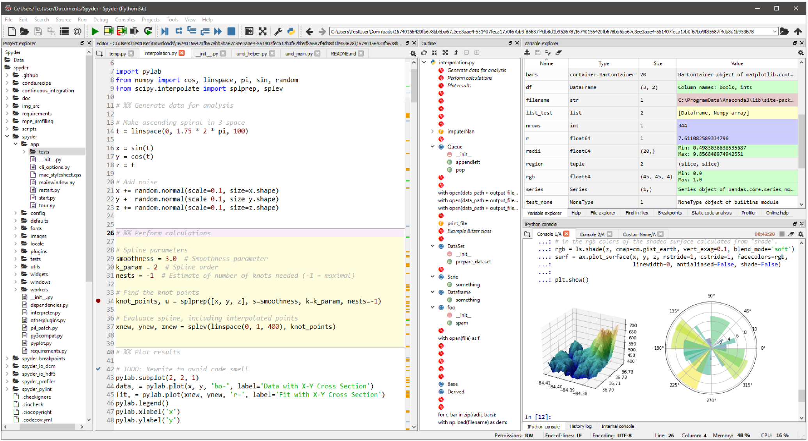

# 陈十八的 Python 之路小序

## I. Python 与脚本语言

Python 是一门脚本语言. 什么是脚本语言呢? 

> Quote from [Wiki](https://zh.wikipedia.org/wiki/%E8%84%9A%E6%9C%AC%E8%AF%AD%E8%A8%80):
> 
> **脚本语言**（英语：Scripting language）是为了缩短传统的“编写、编译、链接、运行”（edit-compile-link-run）过程而创建的计算机编程语言。早期的脚本语言经常被称为批处理语言或工作控制语言。一个脚本通常是解释运行而非编译。脚本语言通常都有简单、易学、易用的特性，目的就是希望能让程序员快速完成程序的编写工作。

简单地解释就是, Python 不像十八之前学过的 C/C++, 写出的源代码不经过编译就无法执行. Python 你每写一句都可以 **run**, 甚至一句有语法错误的 Python 都可以 **run**, 只不过当有错误时会报错 (学名叫 **抛出异常**). 可以这样用 Python 或者其他脚本语言就是因为脚本需要有一个 **解释器 (Interpreter)** 做后台, 这个解释器在十八执行代码时会 **逐句**, 甚至 **逐词(Token)** 地去解释十八输入的命令. 十八用过 Matlab, 它也是一门脚本语言, 所以十八对如何使用脚本应该并不陌生. 最常用的 Python 解释器叫 [**CPython**](https://github.com/python/cpython), 有了这个我们才能开始学习和使用 Python. 接下来我们介绍如何安装解释器并搭建一个简单的 Python 开发环境.

## II. 安装 Python 与开发环境

CPython 解释器可以直接从 [www.python.org](https://www.python.org/) 下载. 但是我们可以不用自己下载 CPython, 十八主要想用 Python 来处理和分析数据, 所以我们最好安装一个 Python 的开发工具集, 这里面会包含 Python 解释器, 的集成开发环境 (IDE), 还有 [conda](https://docs.conda.io/en/latest/) 等软件包管理工具. 在 Windows 平台上, [Anaconda](https://www.anaconda.com/) 是一个非常好用的 Python 开发工具集合, 十八可以直接[下载安装](https://www.anaconda.com/products/individual).

### IDEs

Anaconda 中集成了一个基于网页的 IDE - [Jupyter Notebook](https://jupyter.org/)

和一个传统风格的 IDE - [Spyder](https://www.spyder-ide.org/)

## III. TODO
